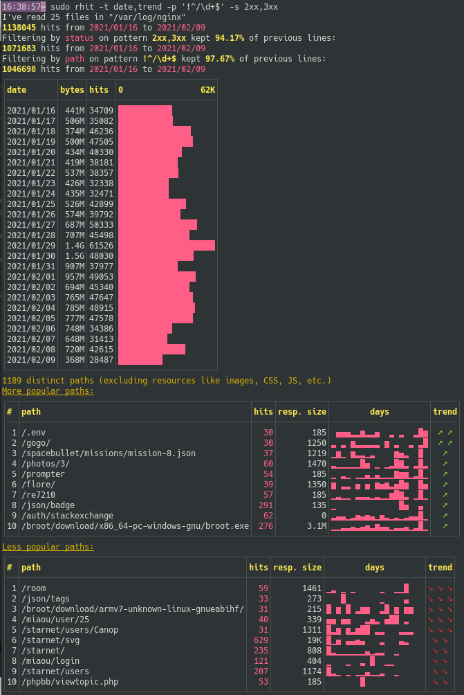
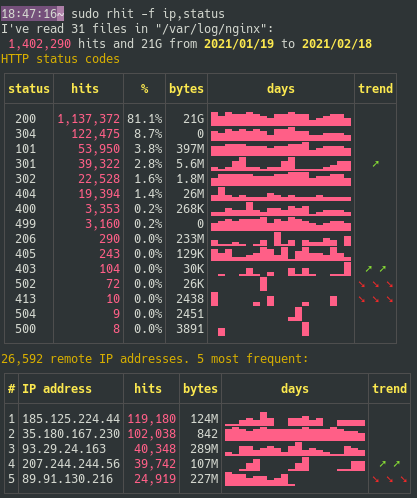

[![Latest Version][s1]][l1] [![MIT][s2]][l2] [![Chat on Miaou][s3]][l3]

[s1]: https://img.shields.io/crates/v/rhit.svg
[l1]: https://crates.io/crates/rhit

[s2]: https://img.shields.io/badge/license-MIT-blue.svg
[l2]: LICENSE

[s3]: https://miaou.dystroy.org/static/shields/room.svg
[l3]: https://miaou.dystroy.org/3768?rust


**Rhit** reads your nginx log files in their standard location(even gzipped), does some analysis and tells you about it in pretty tables in your console, storing and polluting nothing.

It lets you filter hits by dates, status, referers or paths, and does trend analysis.

And it's fast enough (about one second per million lines) so you can iteratively try queries to build your insight.

Here I'm especially looking at dates and trends on hits with status 2xx and 3xx, excluding all paths that are just a number:



# Installation

You need the [Rust](https://rustup.rs) toolchain. Do

```bash
cargo install rhit
```

Rhit is only tested on linux.

# Basic Usage

If rhit is on the server, and the logs are at their usual location:

```bash
rhit
```

(you may have to prefix with sudo to read the files in `/var/log`)

Tell rhit what files to open:

```bash
rhit ~/trav/nginx-logs
```

# Filtering

## Filter on paths

Filtering can be quite simple:

```bash
rhit -p download
```

But the syntax allows for much more interesting queries.

You may use a regular expression:

```bash
rhit -p '^/blog/.*broot'
```

You may negate expressions with a `!`.

For example, I have many paths which are just a number (eg `/12345`) and If I want to filter them, I can do

```bash
rhit -p '!^/\d+$'
```
(remember to use simple quotes and not double quotes to not have your shell interpret the expression)

Separating filters with a comma is an easy way to do a "AND".

If I want to get paths which are neither `broot` or just a number, I'll do

```bash
rhit -p '!^/\d+$,!broot'
```

If I want to get all paths containing a digit, but not just a number, and not `broot`, I do

```bash
rhit -p '!^/\d+$,!broot,\d'
```

For a more complex logic, switch to binary expressions with parentheses and logic operators `&`, `|` and `!`.

For example to get all paths containing `dystroy` or `blog`  but not `broot`:

```bash
rhit -p '( dystroy | blog ) & !broot'
```

(add spaces inside parenthesis to avoid them being understood as part of a regular expression)

To get all paths containing `dystroy` but neither `blog`, nor `space` nor any 4 digits numbers:

```bash
rhit -p 'dystroy & !( \d{4} | space | blog )'
```

## Filter on referer

```bash
rhit -r reddit
```

As for the path, you may use a complex expression.

## Only show a specific day

```bash
rhit -d 12/25
```
If the log contains several years, you need to precise it, eg `rhit -d 2020/12/25`.
Symmetrically, you may omit the month if it's not ambiguous: `rhit -d 25`.

## Only show a period:

```bash
rhit -d 2020/12/25-2021/01/03
```

## Filter by status

The syntax is quite versatile:

```bash
rhit -s 404
rhit -s 5xx
rhit -s 3xx,410-421
rhit -s 301-305
```

## Filter by remote address

```bash
rhit -a 123.123.123.123
rhit -a !123.123.123.123
```

## Combine filters

You can use several arguments.

For example, to get all paths resulting in a `404` but not the `robots.txt` (which are legit queries) or the `/crashy` path:


# Choose what to show

The displayed tables (all by default) can be chosen with the `-t` argument.

For example to only show remote adresses and statuses, use:

```bash
rhit -t addr,status
```



(use `rhit --help` for the complete list)

Table *lengths* is decided with the `-l` argument. Use `rhit -l 0` to have just a few lines in the various tables, and `rhit -l 5` for huge tables. Default value is `1`.


