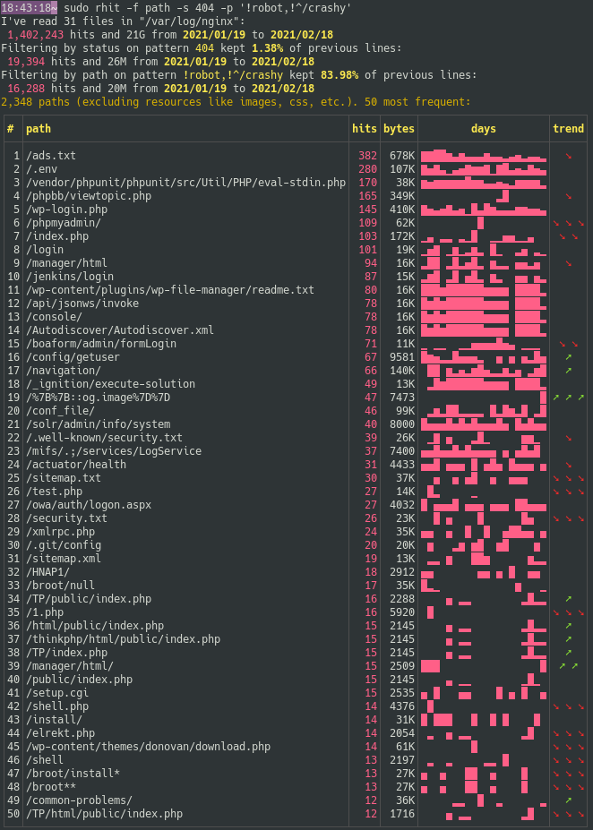

[![Latest Version][s1]][l1] [![MIT][s2]][l2] [![Chat on Miaou][s3]][l3]

[s1]: https://img.shields.io/crates/v/rhit.svg
[l1]: https://crates.io/crates/rhit

[s2]: https://img.shields.io/badge/license-MIT-blue.svg
[l2]: LICENSE

[s3]: https://miaou.dystroy.org/static/shields/room.svg
[l3]: https://miaou.dystroy.org/3768?rust


# Why

You didn't really configure nginx logging, nor the sending of the logs in a dedicated database.

You just have the standard logs and you'd like to have an idea of what happened recently.

This program finds and reads the log files (even gzipped), checks their consistency, does some basic analysis and tells you about it in pretty tables in your console, storing and polluting nothing.

It lets you filter hits by patterns on referers or paths to build your insight.


# Installation

You need the [Rust](https://rustup.rs) toolchain. Do

```bash
cargo install rhit
```

Rhit is only tested on linux.

# Usage

If rhit is on the server, and the logs are at their usual location:

```bash
rhit
```

(you may have to prefix with sudo to read the files in `/var/log`)

Tell rhit what files to open:

```bash
rhit ~/trav/nginx-logs
```

Filter on paths:

```bash
rhit -p download
```

Filter on paths with a regular expression:

```bash
rhit -p "^/blog/.*broot"
```

Filter on referer:

```bash
rhit -r reddit
```

You may combine filters:


