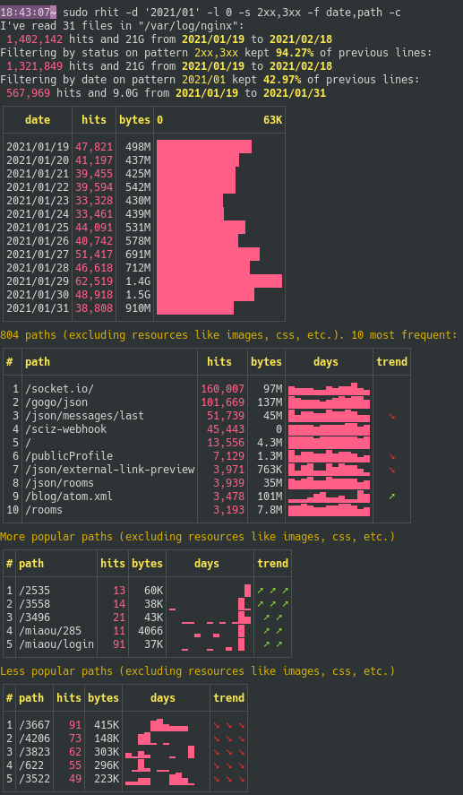

[![Latest Version][s1]][l1] [![MIT][s2]][l2] [![Chat on Miaou][s3]][l3]

[s1]: https://img.shields.io/crates/v/rhit.svg
[l1]: https://crates.io/crates/rhit

[s2]: https://img.shields.io/badge/license-MIT-blue.svg
[l2]: LICENSE

[s3]: https://miaou.dystroy.org/static/shields/room.svg
[l3]: https://miaou.dystroy.org/3768?rust


**Rhit** reads your nginx log files in their standard location(even gzipped), does some analysis and tells you about it in pretty tables in your console, storing and polluting nothing.

It lets you filter hits by dates, status, referers or paths, and does trend analysis.

And it's fast enough (about one second per million lines) so you can iteratively try queries to build your insight.

Here's looking at dates and trends on January hits with status 2xx and 3xx:



# Summary

- [Summary](#summary)
- [Installation](#installation)
  * [From source](#from-source)
  * [From binaries](#from-binaries)
- [Basic Usage](#basic-usage)
- [Filtering](#filtering)
  * [Filter on paths](#filter-on-paths)
  * [Filter on referer](#filter-on-referer)
  * [Only show a specific day](#only-show-a-specific-day)
  * [Only show a period:](#only-show-a-period-)
  * [Filter by status](#filter-by-status)
  * [Filter by remote IP address](#filter-by-remote-ip-address)
  * [Combine filters](#combine-filters)
- [Choose what to show](#choose-what-to-show)
  * [Fields](#fields)
  * [Detail Level](#detail-level)
  * [Path filtering](#path-filtering)
  * [Key](#key)
  * [Changes](#changes)
- [Printing the original log lines](#printing-the-original-log-lines)

# Installation

Rhit is only tested on linux but is expected to work on Mac.

## From source

You need the [Rust](https://rustup.rs) toolchain. Do

```bash
cargo install rhit
```

## From binaries

You may download linux binaries from [https://dystroy.org/rhit/download](https://dystroy.org/rhit/download).

# Basic Usage

If rhit is on the server, and the logs are at their usual location:

```bash
rhit
```

(you may have to prefix with sudo to read the files in `/var/log`)

Tell rhit what files to open:

```bash
rhit ~/trav/nginx-logs
```

# Filtering

## Filter on paths

Filtering can be quite simple:

```bash
rhit -p download
```

But the syntax allows for much more interesting queries.

You may use a regular expression.

For example when I want to see all downloads of broot:

```bash
rhit -p '^/download/.*broot(.exe)?$'
```

You may negate expressions with a `!`.

For example, I have many paths which are just a number (eg `/12345`) and If I want to filter them, I can do

```bash
rhit -p '!^/\d+$'
```
(remember to use simple quotes and not double quotes to not have your shell interpret the expression)

Separating filters with a comma is an easy way to do a "AND".

If I want to get paths which are neither `broot` nor just a number, I'll do

```bash
rhit -p '!^/\d+$,!broot'
```

If I want to get all paths containing a digit, but not just a number, and not `broot`, I do

```bash
rhit -p '!^/\d+$,!broot,\d'
```

For a more complex logic, switch to binary expressions with parentheses and logic operators `&`, `|` and `!`.

For example to get all paths containing `dystroy` or `blog`  but not `broot`:

```bash
rhit -p '( dystroy | blog ) & !broot'
```

(add spaces inside parenthesis to avoid them being understood as part of a regular expression)

To get all paths containing `dystroy` but neither `blog`, nor `space` nor any 4 digits numbers:

```bash
rhit -p 'dystroy & !( \d{4} | space | blog )'
```

## Filter on referer

```bash
rhit -r reddit
```

As for the path, you may use a complex expression.

## Only show a specific day

```bash
rhit -d 12/25
```
This shows only Christmas hits, assuming all the hits are from the same year.
If the log contains several years, you need to precise it, eg `rhit -d 2020/12/25`.
Symmetrically, you may omit the month if it's not ambiguous: `rhit -d 25`.

## Only show a period:

```bash
rhit -d 2020/12/25-2021/01/03
rhit -d 2020/12
rhit -d 2020
rhit -d '>2020/12/25'
rhit -d '!2020/12/25'
rhit -d '<12/25'
```

## Filter by status

The syntax is quite versatile:

```bash
rhit -s 404
rhit -s 5xx
rhit -s 3xx,410-421
rhit -s 301-305
rhit -s '!404'
rhit -s '4xx,!404'
```

## Filter by remote IP address

```bash
rhit -i 123.123.123.123
rhit -i !123.123.123.123
```

## Combine filters

You can use several arguments.

For example, to get all paths resulting in a `404` but not the `robots.txt` (which are legit queries) or the `/crashy` path:


# Choose what to show


## Fields

The displayed fields can be chosen with the `-f` argument.

Default fields: `date,status,ref,path`

Available fields: `date,method,status,ip,ref,path`

For example to only show remote IP adresses, statuses, and referers:

```bash
rhit -f ip,status,ref
```


## Detail Level

Table *lengths* is decided with the `-l` argument.

Use `rhit -l 0` to have just a few lines in the various tables, and `rhit -l 5` for huge tables. Default value is `1`.

## Path filtering

By default the paths tables don't show "resources" like images, CSS, JS. If you don't want this filtering, use the `--all` argument:

```bash
rhit -a
```

## Key

The measure used for sorting, histograms, and trends is either `hits` (default) or `bytes` (bytes in the response).

It's highlighted in pink in the report.

You set it with the `--key` argument:


## Changes

Use the `--changes` (short: `-c`) argument so that Rhit shows you the paths, referers or remote addresses which are notably more popular or less popular.

Settings related to displayed fields and filtered values still apply.

# Printing the original log lines

It's possible to extract the original log lines matching your filters, either to screen or to a file, by adding `--lines` to your command.

For example to write to a file:

```bash
rhit -p 'exe$' -s '!4xx' --lines > lines.txt
```

When you dump lines, some arguments are ignored (`--fields`, `--changes`), you don't have to remove them.

The lines are printed in chronological order, whatever the naming of the source files.

