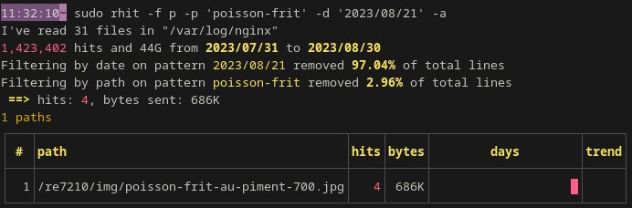
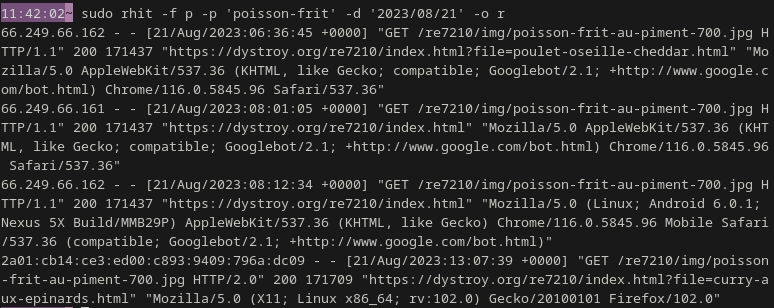
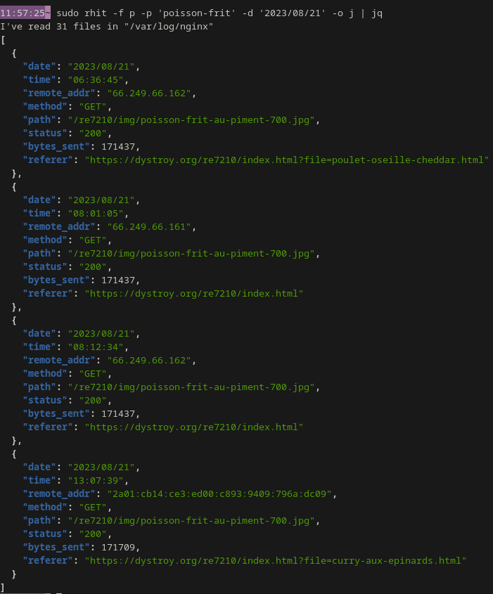

The `--output` arguments controls what **rhit** outputs.

Here are the possible values:

* `tables`: the default summary, as tables
* `raw`: raw lines as they appear in the source log files
* `csv`: CSV
* `json`: JSON

All [filters](../usage-filters) apply, but the choice of fields isn't applied.

For this documentation's screenshots, all outputs are filtered to keep 4 hits, by combining a date filter and a path filter: `-p 'poisson-frit' -d '2023/08/21'`.

## Tables

Here's for example just the `paths` tables, with `-a` so that images aren't excluded:

## Raw

Use `rhit --output raw` or `rhit -o r`

Without filter, this wouldn't be useful: this just unzips, sorts, and concatenates all log files.

While this may be useful sometimes when piped into another tool (log lines aren't loaded in memory, they're streamed as soon as read), this is mostly useful when used with filters.

## CSV

For Comma Separated Values, use `rhit --output csv` or `rhit -o c`.

It's probable that you'll want to export to a file, though: `rhit -o c > log.csv`.

## JSON

Use `rhit -- output json` or `rhit -o j`.

Here's for example piped to [jq](https://jqlang.github.io/jq/):

