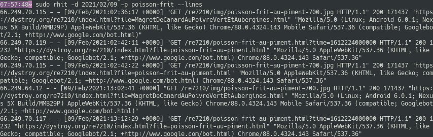

If you want to see the original log lines, you may ask Rhit to export them with `--lines`, either to the console or to a file.

All the filters apply, and the lines are chronologically sorted.

## Export to the console:

```
rhit -s 403 -d 2021/03 --lines
```



## Export to a file

```
rhit -s 403 -d 2021/03 --lines > some/file.txt
```

