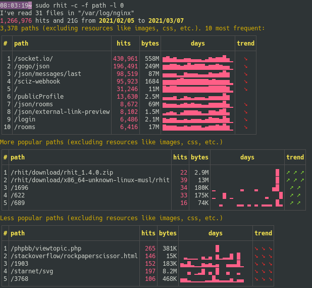
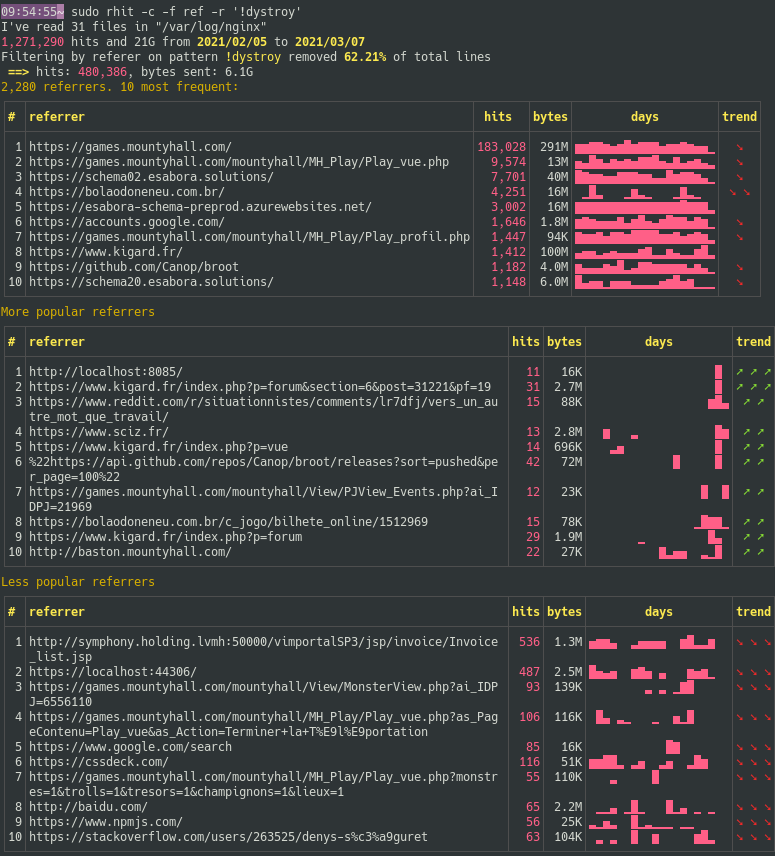

What changed in the last days may not be visible from the most popular paths.

Rhit's `--changes` (shortened in `-c`) can show you what paths are notably more popular or less popular, and what referers have sent you more or less visitors  in the last two days.

The change tables are displayed only if the relevant field is selected.

Filters apply of course.

## Changes on paths

## Changes on referers

