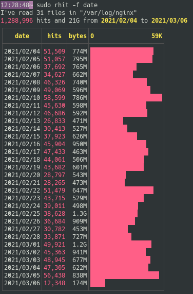
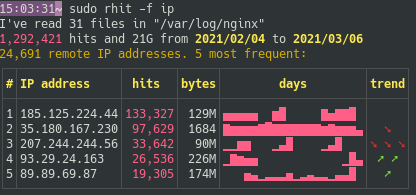
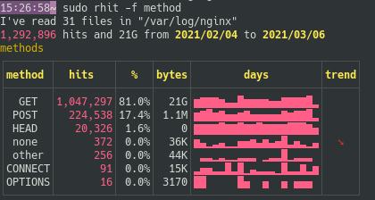
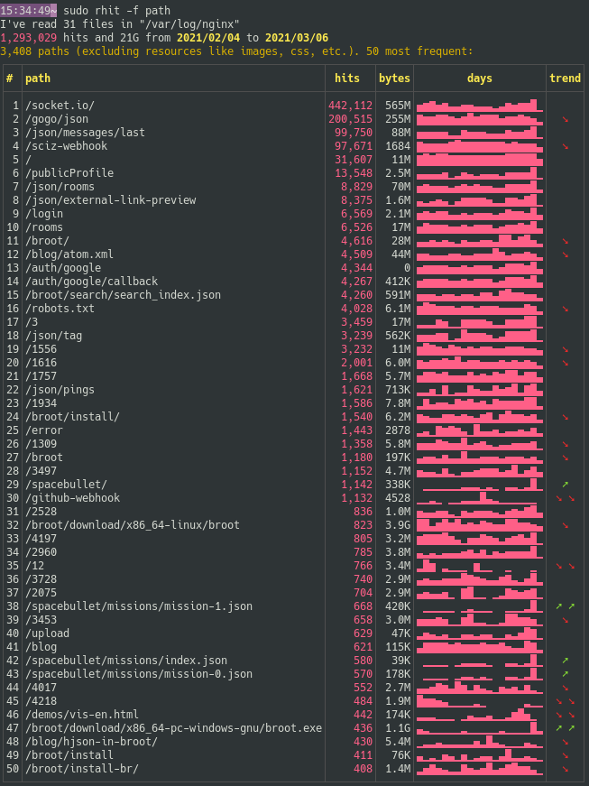
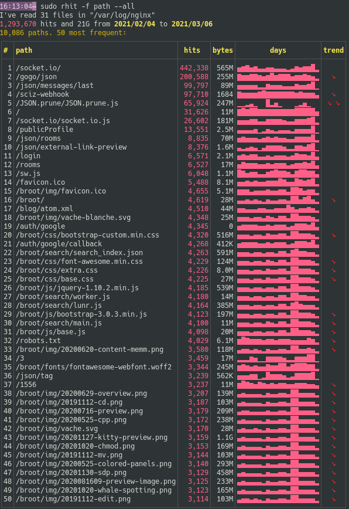
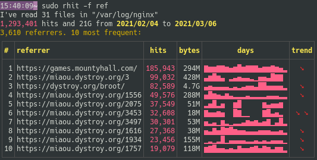
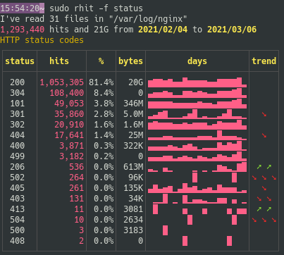

# The fields argument

Here's a typical access log line:

```
178.133.125.122 - - [21/Jan/2021:05:49:52 +0000] "HEAD /broot/download/x86_64-pc-windows-gnu/broot.exe HTTP/1.1" 200 0 "-" "Mozilla/4.0 (compatible; MSIE 6.0; Windows NT 5.1)"
```
It's made of several fields: date, remote IP adress, path, bytes sent, etc.

You can specify the list of fields on which you want sorted tables.

If you specify nothing, the default is to show dates, status, referers and paths.

To specify several fields, separate them with commas, for example `-f date,status`.

To show all fields, use `-f all`.

# Date

This field is shown by an histogram.

You choose it with `--field date`, that you may shorten in `-f date`:



By default the length of the bars is based on the hit counts (in pink). You may base it on sent bytes by changing the [sorting key](../usage-key).

# Remote IP

The remote adresses table isn't displayed by default.

To see it use `rhit -f ip` (or combine it with other fields, for example `rhit -f path,ip,ref`:



As for most fields, you see the number of different values (here the 24,691 remote adresses), the most frequent ones, of for each of them the hits, bytes sent, histogram per day and maybe a trend.

If you want more frequent adresses, use the `--length` field, for example `rhit -l 3`.

# Method

The HTTP method table isn't displayed by default.

To see it use `rhit -f method`:



As you'd see by [exporting the lines](../export) with `rhit -m other --lines`, the "other" methods are usually client errors, that is malformed requests.

# Path

The path is displayed by default.

If you want to see only the path, use `rhit -f path`:



By default some paths are filtered from that tables: the images, scripts, etc.

If you don't want this filter, use the `--all` argument:



# Referer

The referer is one of the default fields. If you want ot see it alone, do `rhit -f ref`

*(yes, it's called "referer" and not "referrer" in the HTTP protocol, so I'll use this spelling everywhere in this documentation for consistency)*



# Status

The status is one of the default fields. If you want ot see it alone, do `rhit -f status`


