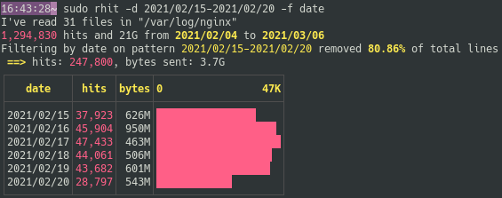
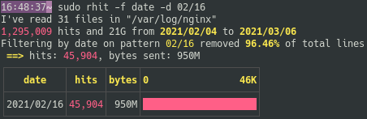
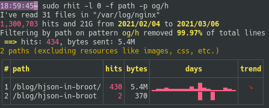
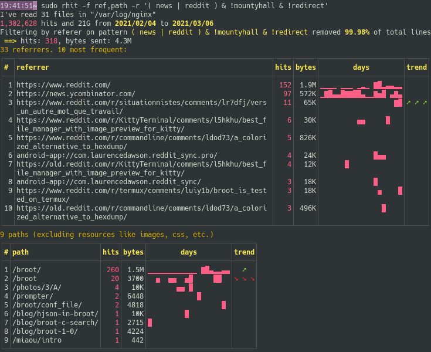

# The filters arguments

While you may discover some big phenomenas when looking at the unfiltered tables, that's only the surface and you'll normally dive soon enough with filters either because the unfiltered data hinted a something interesting or because you wanted to look at some parts of your sites, or some errors, etc.

So there's a filter argument for each field, and they may be combined.

!!! Note
	On most shells, characters like `$`, `<`, `>`, `|`, or `!` have a special meaning if not between single quotes. In case of doubt put your arguments between quotes, for example `rhit -s '!404'`

# Filter by Date

The date filter argument is `--date`, shortened in `-d`.

The precision of dates in rhit is the day, and the order of tokens is year, month (numerical) then day (in 1-31).

For example here are the 6 days in the range from `2021/02/15` to `2021/02/20`:



The filter's behavior is probably better explained with a list of examples:

Purpose|Example
-|-
Show the hits of a specific day | `-d 2021/02/16`
Show the hits of a specific month | `-d 2021/02`
Show the hits of a specific year | `-d 2021`
All days but one | `-d '!2021/02/15'` (don't forget the quotes)
Days after a specific one | `-d '>2021/02/28'`
Days before a specific one | `-d '<2021/02/28'`
Days of a specific range (inclusive) | `-d 2021/11/01-2021/12/25`


Shorcuts are sometimes possible. For example if all the log files are from the same year, you may ommit it:



# Filter by Remote IP Address

Remote IP filters are defined with `--ip`, shortened in `-i`.

You may either filter to show the hits of a specific IP or the other ones.

Purpose|Example
-|-
Show the hits of a specific IP | `-i 35.180.167.230`
Show all hits but the ones of a specific IP | `-i '!35.180.167.230'`

# Filter by Method

Method filters are defined with `--method`, shortened in `-m`.

You may either filter to show the hits of a specific method or the other ones.

Purpose|Example
-|-
Show the hits of a specific method | `-m CONNECT`
Show all hits but the ones of a specific method | `-m '!POST'`

# Filter by Path

The path filter, defined with `--path` (or `-p`) is the most common one and the most powerful, with a versatile syntax.

The simplest path filter is just a word that the path must contain, for example `-p blog` when you want to see all hits on paths with "blog".

Example:



But it may also be a regular expression, for example all paths with "download" and ending in "exe": `-p 'download.*exe$'`.

You may negate an expression with a `!`. For example all hits not ending in ̀"broot/": `-p '!broot/$'

You may add conditions by separating them with commas. To say you want all downloads, but not the exe and not rhit, you can say `-p download,!rhit,!exe$'

If your query is more complex, use parenthesis and logical operators `&`, `|` and `!` (add parenthesis around operators and parenthesis to avoid them being understood as part of regular expressions).

Here's a list of examples

Example | Meaning
-|-
`-p blog` | path contains "blog"
`-p 'blog.*broot'` | path contains "blog" and "broot", in this order
`-p 'blog,broot'` | path contains "blog" and "broot", in whatever order
`-p '^down/.*broot(.exe)?$'` | path starts with "down" and ends in "broot" with optionally "exe"
`-p 'down/(rh|bro)'` | path contains "down/" immediately followed by either "rh" or "bro"
`-p 'down/bro,!exe$'` | path contains "down/bro" and doesn't end in "exe"
`-p 'og | ( broot & !exe )'` | contains "og" or "broot" without "exe"
`-p '!^/\d+$'` | paths that aren't just a number
`-p '!^/\d+$,!broot'` | paths that aren't a number and don't contain "broot"
`-p 'y & !( \d{4} | sp | bl )'` | path contains "y" but neither a 4 digits number, "sp", nor "bl"

# Filter by Referer

Referer filters are specified with `--referer` or `-r`.

They follow exactly the same syntax than [path filters](#filter-by-path).

Example:



# Filter by Status

Status filters are specified with `--status` or `-s`.

The syntax is quite versatile.

Example | Meaning
-|-
`-s 404` | status is 404
`-s '!404'` | status is not 404
`-s 4xx` | status is of class 4xx (client error)
`-s '4xx,!404'` | status is of class 4xx (client error) but not 404
`-s 402-420` | status is between 402 and 420
`-s 3xx,401-405` | status is either in the 3xx class or from 401 to 405

# Combinations

Most often a unique filter isn't enough to study some event or phenomena.

You may want to answer a specific question, like what are the PHP files which aren't just some attacks:

```
rhit -p '\.php$' -s '!4xx'
```

