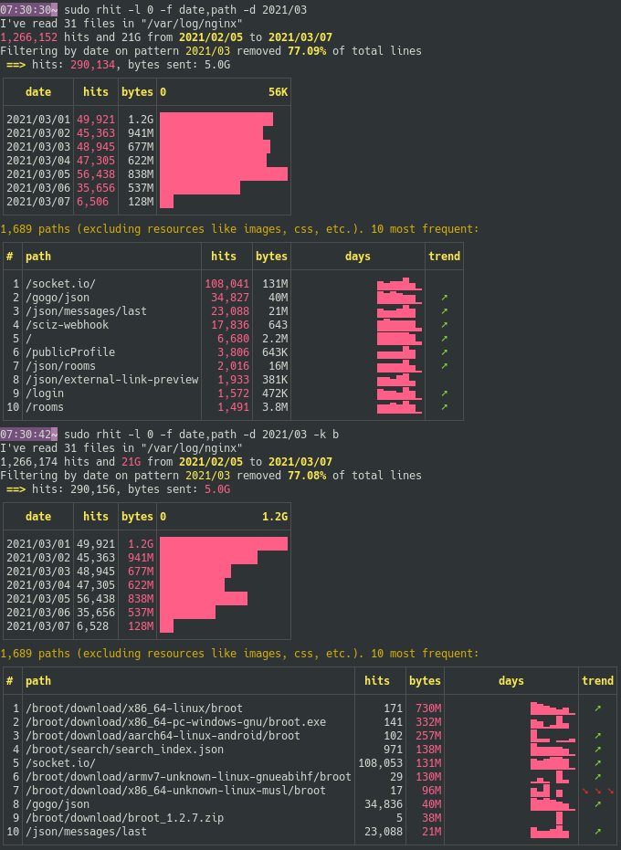

By default all tables are sorted by **hits**.

This is the sorting key.

All vallues of the sorting key are displayed in pink, including the histograms.

If you're more interested in the total sizes in sent bytes, you may change the sorting key to **bytes**.

You do this change with `--key bytes` or `-k b`.

This will impact the selection of lines at the top of tables, the histograms and the trend computations.

Here's an example with first a sort by hits, then one by bytes:

