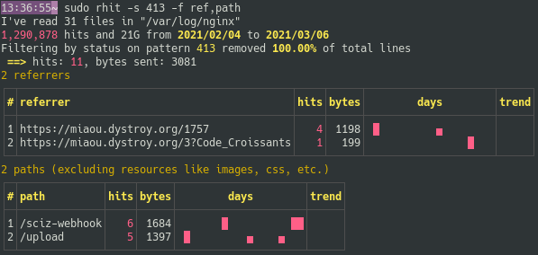

# Clean and Immediate

Rhit works from your standard nginx logs, with no preparation.

You run it in your console, it leaves nothing behind, no temp file, no database.

# Instantly read your access log

You get an immediate overview with `rhit` or `sudo rhit` depending on your configuration

and from there you'll refine your query to get a more precise insight:

# Have new questions, and have them answered

With Rhit, you'll notice unexpected things in your logs. And you'll easily know more.

Here's an example:
Let's suppose you notice a [`413` HTTP code](https://developer.mozilla.org/en-US/docs/Web/HTTP/Status/413) in the status table.

You just have to type `rhit -s 413` to know why:

(I limit the tables displayed with `-f ref,path` in this screenshot in order to keep the image small)

# See the trends

You get an histogram per day of all the matching hits.

For each line in a table, you also get an histogram, in line, and a trend indicator.

And you can get tables of the most notable increases or decreases, for example here on referers:

Of course you can filter, so you may focus for example on the new client errors, or on changes on your blog consultations.
