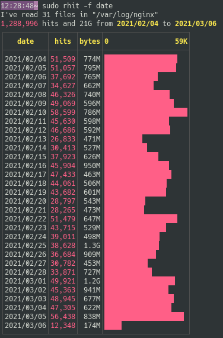
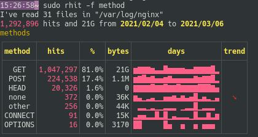
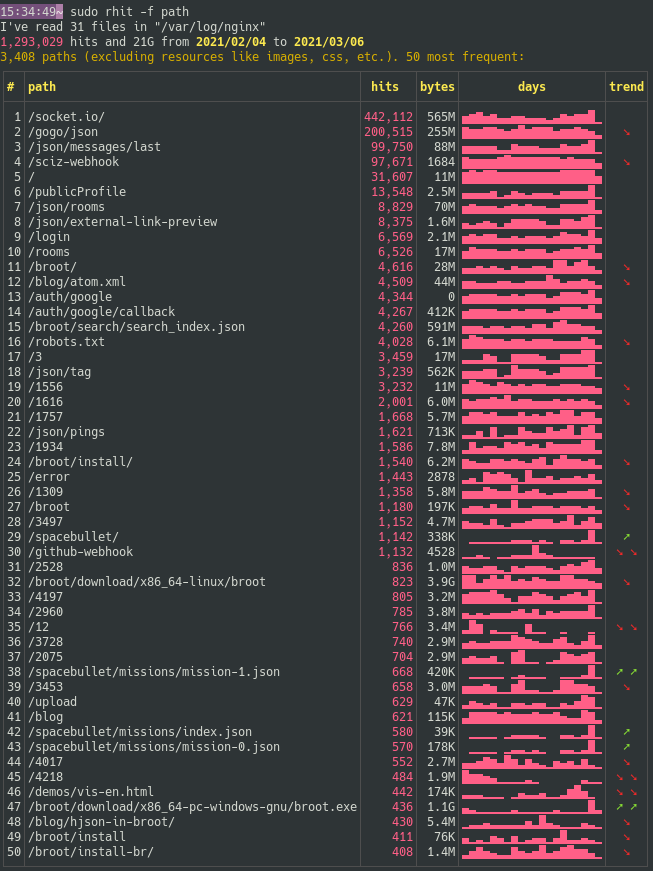
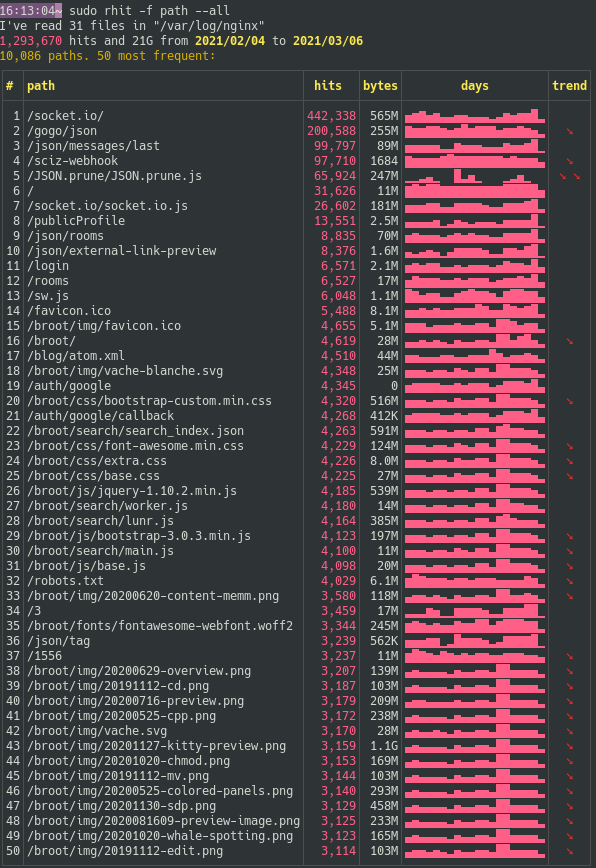

# The fields argument

Here's a typical access log line:

```no-wrap
178.133.125.122 - - [21/Jan/2021:05:49:52 +0000] "HEAD /broot/download/x86_64-pc-windows-gnu/broot.exe HTTP/1.1" 200 0 "-" "Mozilla/4.0 (compatible; MSIE 6.0; Windows NT 5.1)"
```
Rhit can show tables on the following fields:

* date,
* time,
* method
* status
* (remote) IP
* referer
* path

You can specify the list of fields on which you want sorted tables.

If you specify nothing, the default is to show dates, status, referers and paths.

Fields are refered either by their name (eg `ip`) or by their initial (eg `i`).

The syntax is best explained with a few examples

Goal | Argument
-|-
Only the paths | `--field path` or `-f path` or `-f p`
IP and paths | `-f path+ip` or `-f p+i`
The default fields *and* the IP | `-f +ip` or `-f +i`
The default fields *and* IP and status | `-f +ip+status` or `-f +i+s`
The default fields minus dates | `-f -d`
The default fields with IP but not dates | `-f +i-d`
Default fields but paths moved to the end | `-f +p`
All fields except the paths | `-f all-paths` or `-f a-p`
All the fields, with dates moved to the end | `f all+dates` or `-f a+d`

# Date

This field is shown by an histogram.

You choose it with `--field date`, that you may shorten in `-f date` or `-f d`:



By default the length of the bars is based on the hit counts (in pink). You may base it on sent bytes by changing the [sorting key](../usage-key).

# Time

This field is shown by an histogram with 24 bars: one per hour.

You choose it with `--field time`, that you may shorten in `-f d`.

Note that the time is the the server's time.

# Remote IP

The remote adresses table isn't displayed by default.

To see it alone use `rhit -f i`.
To see it with default fields, use `rhit -f +i`


As for most fields, you see the number of different values (here the 24,691 remote adresses), the most frequent ones, of for each of them the hits, bytes sent, histogram per day and maybe a trend.

If you want more frequent adresses, use the `--length` field, for example `rhit -l 3`.

# Method

The HTTP method table isn't displayed by default.

To see it use `rhit -f +m`:



As you'd see by [exporting the lines](../export) with `rhit -m other --lines`, the "other" methods are usually client errors, that is malformed requests.

# Path

The path is displayed by default.

If you want to see only the path, use `rhit -f p`:



By default some paths are filtered from that tables: the images, scripts, etc.

If you don't want this filter, use the `--all` argument:



# Referer

The referer is one of the default fields. If you want ot see it alone, do `rhit -f ref`

*(yes, it's called "referer" and not "referrer" in the HTTP protocol, so I'll use this spelling everywhere in this documentation for consistency)*


# Status

The status is one of the default fields. If you want ot see it alone, do `rhit -f status`


